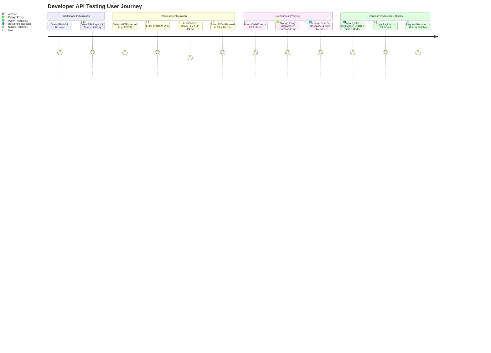

# Product Requirements Document (PRD) — APIHub

## 1. Document Control

| Attribute | Details |
| :--- | :--- |
| **Document Title** | Product Requirements Document (PRD) — APIHub |
| **Project Name** | APIHub — Web-Based API Client & Tester |
| **Document Version** | 1.0.0 |
| **Status** | Approved / Implemented Base Version |
| **Author** | Senior Software Architect & Documentation Engineer |
| **Creation Date** | October 3, 2026 |
| **Target Audience** | Software Developers, QA Engineers, System Integrators, Academic Evaluators |

---

## 2. Product Name
**APIHub** (Sub-titled: *Web-Based API Testing Platform & Proxy Dispatcher*)

---

## 3. Product Overview
APIHub is a web-based, lightweight REST API client and testing platform inspired by Postman. Built with **Django**, **Tailwind CSS**, and **Vanilla JavaScript**, APIHub serves as an interactive workspace where software developers can construct, dispatch, inspect, and persist HTTP requests. 

Crucially, APIHub functions as a backend **server-side proxy dispatcher**. Outbound requests configured in the frontend browser UI are executed by Django using Python's `requests` library. This architecture completely bypasses browser Cross-Origin Resource Sharing (CORS) security restrictions, enabling seamless testing of external public and local REST APIs.

---

## 4. Problem Statement
Frontend developers, backend engineers, and web application integrators frequently need to interact with external REST APIs during development and testing. However, testing APIs directly from standard browser applications faces several bottlenecks:

1. **Browser CORS Limitations**: Standard web browsers enforce strict Same-Origin Policy (SOP) and CORS rules, blocking client-side JavaScript (`fetch`/`XMLHttpRequest`) from querying external APIs that lack explicit CORS headers.
2. **Heavy Desktop Footprint**: Desktop API clients like Postman or Insomnia require significant memory, installation overhead, and cloud account logins for simple, ad-hoc API inspection.
3. **Lack of Request Persistence**: Quick browser console scripts lack structured history, parameter management, and payload formatting.

---

## 5. Proposed Solution
APIHub solves these challenges by providing a responsive, single-page web application (SPA) backed by a Python/Django HTTP proxy engine:
- **Server-Side Outbound Proxying**: The browser communicates exclusively with the local Django backend via `/api/execute/`. Django performs the actual HTTP call to the external server, ignoring browser CORS policies.
- **Zero Desktop Installation**: Accessible directly via any web browser on `http://127.0.0.1:8000/`.
- **Integrated Storage & Tooling**: Offers automatic request history logging in SQLite, real-time JSON validation, query parameter/URL synchronization, syntax-highlighted response rendering, and template presets.

---

## 6. Product Vision
To provide developers with a fast, zero-friction, lightweight web application for testing and debugging HTTP APIs without cloud lock-in or browser CORS restrictions.

---

## 7. Objectives
- **Zero-CORS Restrictions**: 100% of outbound HTTP requests executed through the proxy bypass client browser CORS limitations.
- **Low Overhead & High Responsiveness**: Provide sub-10ms proxy execution overhead for outbound calls.
- **Full HTTP Spec Support**: Support all core HTTP methods (`GET`, `POST`, `PUT`, `PATCH`, `DELETE`, `HEAD`, `OPTIONS`).
- **Seamless Developer Experience**: Real-time URL-parameter two-way binding, keyboard shortcuts (`Ctrl+Enter`), and instantaneous history restoration.

---

## 8. Target Users
- **Backend Developers**: Testing Django, Express, Flask, FastApi, or Spring endpoints during development.
- **Frontend Developers**: Verifying payload contracts and API responses before integrating frontend components.
- **QA & Test Engineers**: Validating status codes, header configurations, and edge-case response payloads.
- **Students & Educator Teams**: Learning REST API concepts without needing heavy desktop installations.

---

## 9. User Personas

### Persona 1: Alex — Full-Stack Developer
- **Role**: Senior Developer working on multi-service architecture.
- **Need**: Needs to test a third-party API that does not return `Access-Control-Allow-Origin` headers without setting up a backend curl script.
- **Goal**: Fire quick requests, inspect JSON data with syntax highlighting, and copy response objects instantly.

### Persona 2: Maya — QA Automation Engineer
- **Role**: Software Tester validating staging API behavior.
- **Need**: Wants to send authenticated requests with Bearer tokens and verify status codes and response headers.
- **Goal**: Quickly review past execution history and restore previous payloads for regression checks.

---

## 10. User Problems & Solutions Summary

| User Problem | APIHub Solution |
| :--- | :--- |
| Browser blocks API fetch due to missing CORS headers | Django backend acts as proxy, making server-to-server HTTP calls using `requests` |
| Difficulty constructing URLs with complex query string params | Interactive key-value table automatically syncs with the URL bar in real-time |
| Unformatted raw JSON response strings hard to read | Client-side syntax highlighter renders formatted JSON with color-coded data types |
| Losing past test configurations when refreshing page | Automatic SQLite persistence in `RequestHistory` table with 1-click restore |

---

## 11. Product Scope

### In-Scope (Implemented Baseline Version 1.0)
- Single Page Application UI built with Django template & Tailwind CSS CDN.
- Support for 7 HTTP methods: `GET`, `POST`, `PUT`, `PATCH`, `DELETE`, `HEAD`, `OPTIONS`.
- Proxy engine executing outbound requests using `requests.request()` with a 15-second timeout limit.
- Real-time two-way synchronization between URL string and query parameter rows.
- Custom HTTP header configuration with preset shortcuts (e.g., `Content-Type: application/json`).
- Authentication mechanisms: `No Auth`, `Bearer Token`, and `Basic Auth`.
- Monospace JSON request body editor with real-time validation, formatting, and sample insertion.
- Response Inspector displaying Status Code, Reason, Latency (ms), Size (KB), Syntax-highlighted JSON, Raw Text, and Headers table.
- History sidebar storing execution history in SQLite with search filtering, click-to-restore, and clear all history.
- Quick template presets for JSONPlaceholder and HttpBin endpoints.
- Global keyboard shortcut (`Ctrl + Enter` / `Cmd + Enter`) to dispatch requests.
- Django unit test suite verifying views, proxy mocking, and database interactions.

### Out-of-Scope (Excluded from Current Version 1.0)
- User authentication, multi-tenant accounts, or login screens.
- Collection export/import (Postman v2 collections, OpenAPI/Swagger spec parsing).
- Automated test script scripting (e.g. JS assertions on response status).
- WebSocket, GraphQL, or gRPC protocol testing.
- Environment variable dynamic interpolation (e.g., `{{baseUrl}}/users`).
- Team workspace sharing or cloud sync.

---

## 12. Feature Requirements Matrix

> **Note**: Current implemented features are marked as **[CURRENT]**, while potential roadmap items are marked as **[FUTURE]**.

| Feature ID | Category | Feature Name | Description | Status |
| :--- | :--- | :--- | :--- | :--- |
| **FEAT-01** | Proxy Engine | Outbound Request Proxy | Proxy request execution via Django backend to bypass CORS | **[CURRENT]** |
| **FEAT-02** | HTTP Methods | Method Selection | Support GET, POST, PUT, PATCH, DELETE, HEAD, OPTIONS | **[CURRENT]** |
| **FEAT-03** | URL & Params | Query Param Sync | Two-way binding between URL query string and parameter rows | **[CURRENT]** |
| **FEAT-04** | Headers | Custom Header Editor | Add/remove headers with enabled checkboxes and preset shortcuts | **[CURRENT]** |
| **FEAT-05** | Auth | Authentication Modes | No Auth, Bearer Token (header), and Basic Auth (base64) | **[CURRENT]** |
| **FEAT-06** | Request Body | JSON Editor & Tools | Raw body editor with live JSON validation and 1-click format | **[CURRENT]** |
| **FEAT-07** | Response | Metric Display | Show HTTP status badge, execution time (ms), and size (KB) | **[CURRENT]** |
| **FEAT-08** | Response | Syntax Highlighting | Colorized JSON response rendering (keys, strings, numbers, nulls) | **[CURRENT]** |
| **FEAT-09** | Response | Response Copy | 1-click response payload copy to system clipboard | **[CURRENT]** |
| **FEAT-10** | History | Request Persistence | Automatic database logging in SQLite `RequestHistory` table | **[CURRENT]** |
| **FEAT-11** | History | History Sidebar & Filter | Search past history by method, URL, or status code | **[CURRENT]** |
| **FEAT-12** | History | Restore History | Click history entry to populate URL, method, headers, and body | **[CURRENT]** |
| **FEAT-13** | Templates | Quick Presets | Pre-configured request templates for JSONPlaceholder & HttpBin | **[CURRENT]** |
| **FEAT-14** | UX | Keyboard Shortcut | Send request via `Ctrl+Enter` or `Cmd+Enter` | **[CURRENT]** |
| **FEAT-15** | Workspace | Collections & Folders | Group related API requests into named folders | **[FUTURE]** |
| **FEAT-16** | Variables | Environment Variables | Define global and environment-level key-value variables | **[FUTURE]** |
| **FEAT-17** | OpenAPI | Swagger/OpenAPI Import | Import OpenAPI 3.0 YAML/JSON files to generate requests | **[FUTURE]** |
| **FEAT-18** | Automation | JS Response Assertions | Write post-execution assertions (e.g., `pm.response.to.have.status(200)`) | **[FUTURE]** |

---

## 13. Non-Functional Requirements (NFRs)

### Performance
- **Proxy Latency**: Django backend processing overhead must not exceed **15ms** (excluding target API network latency).
- **Page Load Time**: Initial load of SPA interface under **1.0 second** on local network.

### Usability & Design
- **Theme**: Dark mode UI utilizing Tailwind CSS dark palette (`#0b0f17` background, slate typography).
- **Typography**: Inter for UI prose, JetBrains Mono for code editors, JSON outputs, and status badges.
- **Responsiveness**: Fully functional layout on desktop (1920x1080) and laptop (1366x768), with collapsible sidebar for mobile screens.

### Reliability & Error Handling
- **Timeout Protection**: Strict **15-second** timeout on outbound requests to prevent hanging proxy threads.
- **Graceful Error Recovery**: Connection errors, DNS resolution failures, and HTTP timeouts mapped to structured JSON error responses (502, 504, 500).

---

## 14. User Stories

### US-01: Sending a GET Request
> **As a** developer  
> **I want to** select GET, enter `https://jsonplaceholder.typicode.com/posts/1`, and click Send  
> **So that** I can inspect the JSON data and verify HTTP status code 200.

### US-02: Bypassing Browser CORS
> **As a** frontend engineer  
> **I want to** send a request to a local API endpoint without CORS headers  
> **So that** I can test its responses without modifying the target server's CORS configuration.

### US-03: Authenticated Request Execution
> **As a** tester  
> **I want to** select Bearer Token auth mode and enter my JWT token  
> **So that** APIHub automatically injects `Authorization: Bearer <token>` into outgoing request headers.

### US-04: Restoring Request History
> **As a** developer  
> **I want to** click a past request in the sidebar history list  
> **So that** all method settings, URL, headers, and body content are instantly restored into the workspace.

---

## 15. User Journey Diagram

---

## 16. UI/UX Requirements
1. **Single-Page Layout**: No full-page reloads. All HTTP executions, tab switching, and history filtering occur asynchronously via Fetch API.
2. **Color-Coded HTTP Method Badges**:
   - `GET`: Green (`#10b981`)
   - `POST`: Amber (`#f59e0b`)
   - `PUT`: Blue (`#3b82f6`)
   - `PATCH`: Purple (`#a855f7`)
   - `DELETE`: Rose (`#ef4444`)
   - `HEAD` / `OPTIONS`: Slate (`#64748b`)
3. **Interactive Tabs**:
   - Request Config: `Params`, `Headers`, `Authorization`, `Body`.
   - Response Inspector: `Response Body` (Pretty), `Headers` (Table), `Raw Text`.

---

## 17. Success Criteria
- **Functional Correctness**: 100% pass rate across Django test suite (`client/tests.py`).
- **Zero CORS Blockage**: Verified execution against CORS-restricted endpoints.
- **History Synchronization**: Every executed proxy request creates an entry in `db.sqlite3`.

---

## 18. Constraints & Assumptions

### Constraints
- **Single-User Local Deployment**: Default configuration uses SQLite and Django dev server intended for local development (`127.0.0.1:8000`).
- **Synchronous Execution**: Outbound requests block the Django thread for the duration of the external call (up to 15s timeout).

### Assumptions
- Python 3.11+ and Django 5.2 are available in the execution environment.
- The host machine has active internet connectivity for dispatching requests to external public APIs.

---

## 19. Risks & Mitigations

| Risk | Impact | Likelihood | Mitigation Strategy |
| :--- | :--- | :--- | :--- |
| External API hangs indefinitely | High | Medium | Hardcoded 15-second timeout in `requests.request()` call |
| Malformed JSON body submitted | Low | High | Frontend JSON validation & backend `try-except` JSON parsing |
| Massive response payload crashes browser | Medium | Low | Raw text rendering & slice truncation in frontend viewer |
| SQLite database lock on concurrent requests | Low | Low | Light development workload; SQLite default timeout handling |

---

## 20. Acceptance Criteria

- [x] Application loads without errors on `http://127.0.0.1:8000/`.
- [x] Outbound HTTP requests to external domains succeed regardless of target CORS settings.
- [x] Execution metrics (status code, latency ms, size KB) display accurately.
- [x] Executed requests are logged to `RequestHistory` and visible in sidebar.
- [x] Clicking a history item restores its parameters, headers, URL, and body.
- [x] All automated unit tests pass via `python manage.py test`.
