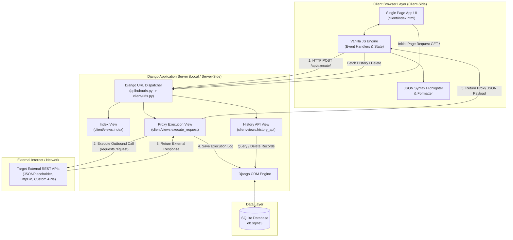
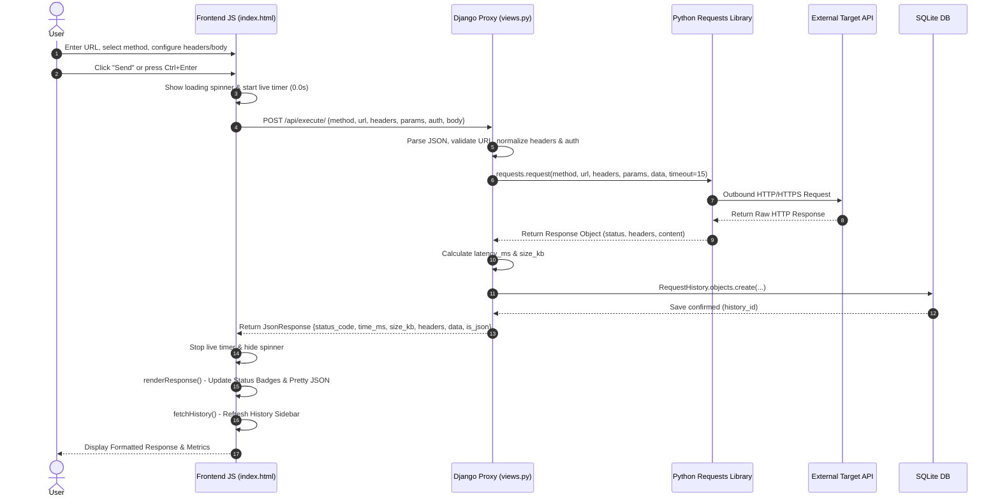
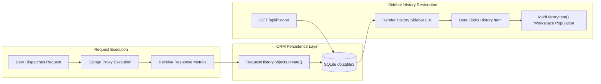
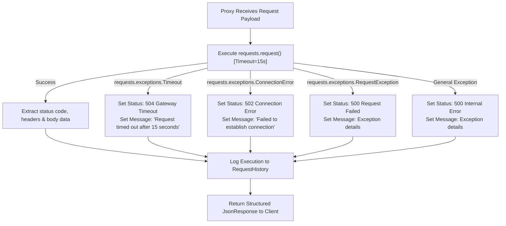

# System Architecture & Technical Design — APIHub

## 1. Architecture Overview

APIHub is built as a **Single-Page Application (SPA) with a Server-Side Proxy Engine** architecture. 

Unlike traditional API clients that run purely in the browser (and suffer from CORS security blocks) or desktop native apps (which require installation), APIHub combines a browser UI with a Python/Django backend HTTP proxy dispatcher.

### Core Architecture Principles
1. **Decoupled Outbound Proxying**: The browser front-end never communicates directly with external API endpoints. All outbound HTTP calls are dispatched through the Django backend proxy view (`execute_request`).
2. **CORS Bypassing by Design**: Browser Same-Origin Policy (SOP) restrictions apply only to browser-to-server requests. Because the Django backend makes standard server-to-server HTTP calls using Python's `requests` library, browser CORS rules are completely bypassed.
3. **Stateless Proxy with State-Logged History**: The proxy engine executes requests statelessly while concurrently persisting execution metrics into an SQLite database for history retrieval and restoration.

---

## 2. Technology Stack

| Layer | Technology / Package | Role & Description |
| :--- | :--- | :--- |
| **Frontend UI** | HTML5, Vanilla JavaScript (ES6+) | Single-Page UI layout, state management, event listeners, dynamic DOM manipulation |
| **Styling & Theme** | Tailwind CSS (via CDN) | Dark-mode design system (`#0b0f17`), responsive flex grid, component utility classes |
| **Typography** | Inter & JetBrains Mono | UI text, code editor typography, JSON output rendering, monospace badges |
| **Backend Web Framework** | Python 3.11, Django 5.2 | Routing, view dispatching, template rendering, JSON HTTP responses |
| **HTTP Engine** | Python `requests` library | Outbound server-side HTTP request execution, header parsing, connection pooling |
| **Database & ORM** | SQLite 3, Django ORM | Relational persistence of historical API requests (`RequestHistory` table) |

---

## 3. High-Level Architecture Diagram



---

## 4. Component Architecture

The project is structured into two main packages: `apihub` (project configuration) and `client` (core application module).

```text
apihub/
├── settings.py              # Application settings, installed apps, SQLite database config
├── urls.py                  # Root URL configuration routing to client app
├── wsgi.py                  # WSGI entry point for traditional web deployment
└── asgi.py                  # ASGI entry point for asynchronous web deployment

client/
├── models.py                # Database model: RequestHistory
├── views.py                 # Core business logic: proxy dispatcher & history management
├── urls.py                  # App URL routes ('/', '/api/execute/', '/api/history/')
├── tests.py                 # Django unit test suite with mock proxy testing
├── apps.py                  # App configuration metadata
├── admin.py                 # Admin registration for RequestHistory model
└── templates/
    └── client/
        └── index.html       # Single-Page Application HTML structure, Tailwind CSS & JS script
```

---

## 5. Component Responsibilities & File Breakdown

### A. `apihub/settings.py`
- Defines global project settings, including `DEBUG = True`, `ALLOWED_HOSTS = ['*']`.
- Registers `'client'` in `INSTALLED_APPS`.
- Configures SQLite database engine pointing to `BASE_DIR / 'db.sqlite3'`.
- Configures Django middleware stack including `CsrfViewMiddleware` and `SecurityMiddleware`.

### B. `apihub/urls.py`
- Root routing configuration mapping the root path `''` to `client.urls`.
- Includes Django admin route `/admin/`.

### C. `client/urls.py`
- Defines route names under the `client` namespace:
  - `path('', views.index, name='index')`
  - `path('api/execute/', views.execute_request, name='execute_request')`
  - `path('api/history/', views.history_api, name='history_api')`

### D. `client/models.py`
- Implements `RequestHistory(models.Model)`:
  - Stores `method`, `url`, `headers` (JSONField), `params` (JSONField), `body` (TextField), `status_code`, `status_text`, `response_time_ms`, `response_size_kb`, and `timestamp`.
  - Provides `to_dict()` helper method to serialize database instances into clean JSON dictionaries.

### E. `client/views.py`
- Contains core application controllers:
  - `index(request)`: Renders `client/index.html` with recent history records (`RequestHistory.objects.all()[:30]`).
  - `_normalize_key_values(items)`: Utility function converting dicts or enabled key-value object lists into normalized Python dictionaries.
  - `execute_request(request)`: Main `@csrf_exempt` `@require_http_methods(["POST"])` proxy controller. Extracts payload, normalizes headers/params/auth/body, invokes `requests.request()`, measures performance via `time.perf_counter()`, catches timeouts/errors, logs to `RequestHistory`, and returns `JsonResponse`.
  - `history_api(request)`: `@csrf_exempt` `@require_http_methods(["GET", "DELETE"])` history endpoint. Handles history list retrieval and bulk/single item deletion.

### F. `client/templates/client/index.html`
- Contains complete SPA user interface:
  - Navigation bar, quick template presets, method dropdown, URL input, send button.
  - Request tabs (Params, Headers, Auth, Body) and context helpers (Format JSON, Sample JSON).
  - Response panel with live execution timer, status metrics, syntax-highlighted JSON renderer, raw text view, and headers grid.
  - History sidebar with search filter, click-to-restore event handlers, and toast notification popups.

---

## 6. Detailed Data & Execution Flow Diagrams

### A. Request Lifecycle Sequence



---

### B. Request History Flow



---

### C. Error Handling Flow



---

## 7. Security Considerations

1. **Server-Side Request Forgery (SSRF) Protection**:
   - The Django backend enforces strict protocol parsing (`https://` default prepending) and delegates socket management to Python `requests`.
   - Timeout limit of **15 seconds** prevents Denial of Service (DoS) from slow-loris target endpoints.
2. **Cross-Site Request Forgery (CSRF)**:
   - Proxy endpoints (`/api/execute/` and `/api/history/`) utilize `@csrf_exempt` to support frictionless REST API calls from the client-side single page app.
3. **HTML Sanitization**:
   - The frontend JavaScript engine uses `escapeHtml()` utilities to escape HTML special characters (`&`, `<`, `>`, `"`, `'`) before rendering headers, raw text, or history entries, preventing Cross-Site Scripting (XSS) vulnerabilities.

---

## 8. Deployment & Scalability Considerations

### Current Local Deployment Model
- Runs locally using Django's built-in WSGI development server (`python manage.py runserver`).
- Single SQLite database file (`db.sqlite3`).

### Production Deployment Path
For multi-user or high-concurrency production deployments:
1. **WSGI Server**: Replace `runserver` with **Gunicorn** or **Uvicorn** behind an **Nginx** reverse proxy.
2. **Asynchronous Proxying**: Upgrade proxy view from synchronous `requests` to asynchronous `httpx` or `aiohttp` running under Django's ASGI interface (`apihub/asgi.py`) to prevent blocking worker threads during external API latency.
3. **Database Upgrade**: Migrate SQLite to **PostgreSQL** for high-volume concurrent history logging.

---

## 9. Phase 5 Advanced Architecture Flows

### A. OpenAPI Import & Converter Flow
```
User
  │ (Upload Specification JSON / YAML)
  ▼
Validation (Safe Parser yaml.safe_load & json.loads)
  │
  ▼
OpenAPI Specification Model (ApiSpecification)
  │
  ▼
Converter Engine (_parse_openapi_spec)
  │
  ▼
APIHub Models (Collection + SavedRequests)
```

### B. Scheduled API Monitoring & Alert Flow
```
Scheduler (python manage.py run_monitors)
  │
  ▼
Monitor Lookup & Safety Check (_is_safe_url)
  │
  ▼
Request Dispatch Engine (HTTP execution with 15s timeout)
  │
  ▼
External Target API
  │
  ▼
Result Analysis & Latency Evaluation
  │
  ▼
MonitorRun Record Created
  │
  ▼
Alert Deduplication Engine (_process_monitor_alerts)
  │
  ▼
Notification Dispatched (MONITOR_DOWN / MONITOR_RECOVERED)
```

### C. Mock Endpoint Server Flow
```
Client Application / External Webhook
  │ (HTTP GET / POST / PUT / DELETE)
  ▼
Mock Router (/api/mock/<mock_key>/)
  │
  ▼
Mock Endpoint Resolver (MockEndpoint lookup & active check)
  │
  ▼
Latency Delay Simulation (time.sleep up to 3000ms)
  │
  ▼
Configured Response Dispatched (Custom status, headers, body)
```

---

## 10. Phase 7 Final Product Architecture

```
                    ┌───────────────────────┐
                    │       APIHub          │
                    │       Web App         │
                    └───────────┬───────────┘
                                │
              ┌─────────────────┼─────────────────┐
              │                 │                 │
              ▼                 ▼                 ▼
        Request Engine      Test Engine       OpenAPI
              │                 │                 │
              ▼                 ▼                 ▼
        External APIs       Assertions       Contracts
              │                 │
              └──────────┬──────┘
                         ▼
                    Monitoring
                         │
                 ┌───────┴───────┐
                 ▼               ▼
               Alerts          Health
                         
        ┌───────────────────────────────┐
        │      Collaboration Layer      │
        │ Workspace / RBAC / Teams      │
        └───────────────────────────────┘

        ┌───────────────────────────────┐
        │     Developer Ecosystem       │
        │ CLI / CI / GitHub / Webhooks  │
        └───────────────────────────────┘

        ┌───────────────────────────────┐
        │   Intelligence & Diagnostics  │
        │ Assistant / Code Gen / Diff   │
        └───────────────────────────────┘
```

### Key Subsystems in Final Product Architecture:
1. **APIHub Smart Assistant & Intelligence Layer**:
   - Dual-mode local deterministic rules engine + server-side external AI integration (`AI_PROVIDER`, `AI_API_KEY`).
   - Secret redaction filter ensuring passwords, bearer tokens, and secrets are never exposed to external providers.
   - Dynamic JSON Schema (Draft-07) and OpenAPI 3.0 response component generators.
2. **Developer Productivity & Code Generators**:
   - Multi-language request converter (cURL, Python Requests, JS Fetch, JS Axios, Go net/http, PHP cURL, Java HttpClient).
   - Structural JSON-aware response diffing and OpenAPI specification diffing.
3. **Workspace Health & Quality Score**:
   - Empirical "API Configuration Completeness" score calculated from available metadata.
   - Diagnostic scans for undefined variables (`{{var}}`), duplicate endpoints, unused requests (>30 days), and broken HTTP schemes.
4. **Isolated Presentation Demo Mode**:
   - Isolated `is_demo=True` workspace with synthetic datasets for demonstration without external mutation risks.

