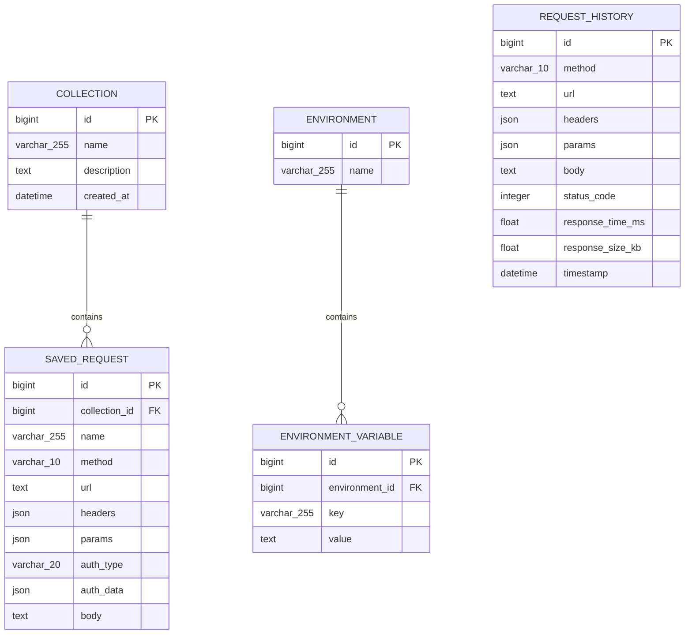
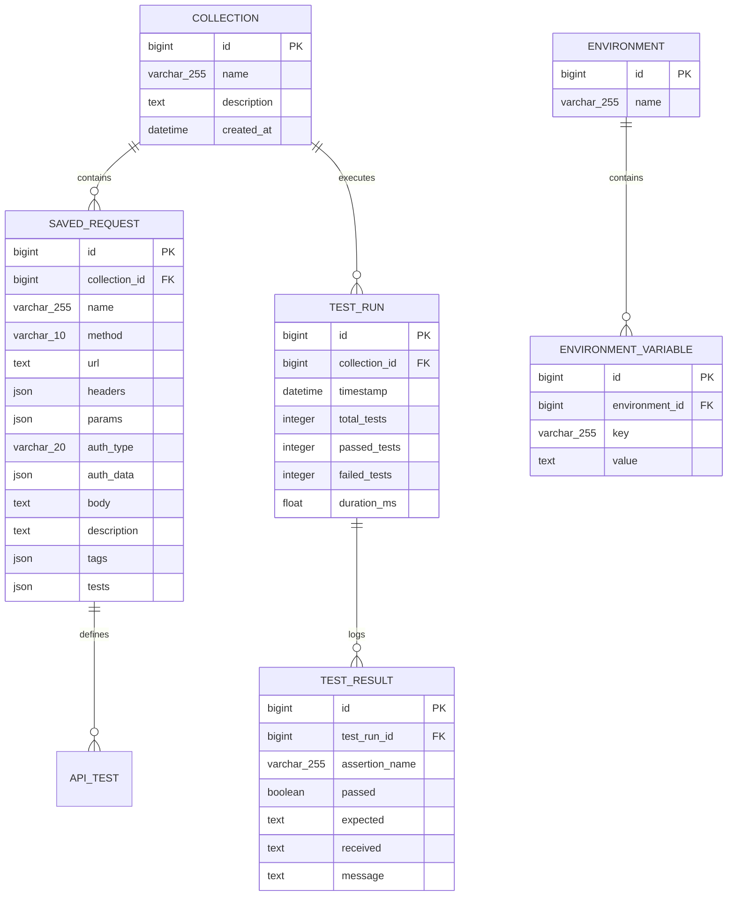

# Database & API Documentation — APIHub

## PART A — DATABASE DOCUMENTATION

### 1. Overview
APIHub utilizes Django's Object-Relational Mapping (ORM) framework backed by an **SQLite 3** relational database (`db.sqlite3`). The database persists request history, API collections, saved request configurations, environments, and environment variables.

---

### 2. Entity Specifications & Models

#### Model 1: `Collection` (`client.models.Collection`)
- **Table Name**: `client_collection`
- **Purpose**: Groups related saved API requests into named folders.

| Field Name | Data Type | Database Type | Required | Default | Description |
| :--- | :--- | :--- | :--- | :--- | :--- |
| `id` | BigAutoField | `INTEGER PRIMARY KEY` | Auto | Auto | Unique collection ID |
| `name` | CharField(255) | `varchar(255)` | Required | None | Collection folder name |
| `description` | TextField | `text` | Optional | `''` | Optional details |
| `created_at` | DateTimeField | `datetime` | Auto | `auto_now_add` | Creation timestamp |
| `updated_at` | DateTimeField | `datetime` | Auto | `auto_now` | Modification timestamp |

#### Model 2: `SavedRequest` (`client.models.SavedRequest`)
- **Table Name**: `client_savedrequest`
- **Purpose**: Stores individual API request configurations belonging to a collection.

| Field Name | Data Type | Database Type | Required | Default | Description |
| :--- | :--- | :--- | :--- | :--- | :--- |
| `id` | BigAutoField | `INTEGER PRIMARY KEY` | Auto | Auto | Unique request ID |
| `collection` | ForeignKey(Collection) | `integer FK` | Optional | `NULL` | Parent collection reference |
| `name` | CharField(255) | `varchar(255)` | Required | None | Display title of request |
| `method` | CharField(10) | `varchar(10)` | Required | `'GET'` | HTTP method |
| `url` | TextField | `text` | Optional | `''` | Request URL |
| `headers` | JSONField | `json` / `text` | Optional | `[]` | List of header key-value objects |
| `params` | JSONField | `json` / `text` | Optional | `[]` | List of param key-value objects |
| `auth_type` | CharField(20) | `varchar(20)` | Optional | `'none'` | Auth mode (`none`, `bearer`, `basic`) |
| `auth_data` | JSONField | `json` / `text` | Optional | `{}` | Auth credentials object |
| `body` | TextField | `text` | Optional | `''` | Request body string |

#### Model 3: `Environment` (`client.models.Environment`)
- **Table Name**: `client_environment`
- **Purpose**: Named container for environment variables (e.g., Development, Production).

| Field Name | Data Type | Database Type | Required | Default | Description |
| :--- | :--- | :--- | :--- | :--- | :--- |
| `id` | BigAutoField | `INTEGER PRIMARY KEY` | Auto | Auto | Unique environment ID |
| `name` | CharField(255) | `varchar(255)` | Required | None | Environment title |

#### Model 4: `EnvironmentVariable` (`client.models.EnvironmentVariable`)
- **Table Name**: `client_environmentvariable`
- **Purpose**: Key-value pair used for `{{variable}}` substitution.

| Field Name | Data Type | Database Type | Required | Default | Description |
| :--- | :--- | :--- | :--- | :--- | :--- |
| `id` | BigAutoField | `INTEGER PRIMARY KEY` | Auto | Auto | Unique variable ID |
| `environment` | ForeignKey(Environment)| `integer FK` | Required | None | Parent environment reference |
| `key` | CharField(255) | `varchar(255)` | Required | None | Variable placeholder key |
| `value` | TextField | `text` | Optional | `''` | Replacement value |

#### Model 5: `RequestHistory` (`client.models.RequestHistory`)
- **Table Name**: `client_requesthistory`
- **Purpose**: Audit log of executed HTTP proxy calls.

| Field Name | Data Type | Database Type | Required | Default | Description |
| :--- | :--- | :--- | :--- | :--- | :--- |
| `id` | BigAutoField | `INTEGER PRIMARY KEY` | Auto | Auto | Primary key ID |
| `method` | CharField(10) | `varchar(10)` | Required | None | HTTP method |
| `url` | TextField | `text` | Required | None | Target URL string |
| `headers` | JSONField | `json` | Optional | `{}` | Headers dictionary |
| `params` | JSONField | `json` | Optional | `{}` | Params dictionary |
| `body` | TextField | `text` | Optional | `''` | Body payload string |
| `status_code` | IntegerField | `integer` | Optional | `NULL` | Returned HTTP status code |
| `status_text` | CharField(100) | `varchar(100)` | Optional | `''` | Status reason phrase |
| `response_time_ms`| FloatField | `real` | Optional | `NULL` | Execution time in ms |
| `response_size_kb`| FloatField | `real` | Optional | `NULL` | Response size in KB |
| `timestamp` | DateTimeField | `datetime` | Auto | `auto_now_add` | UTC creation timestamp |

---

### 3. Entity-Relationship (ER) Diagram

---

#### Model 6: `ApiTest` (`client.models.ApiTest`)
- **Table Name**: `client_apitest`
- **Purpose**: Defines automated test assertions linked to saved requests or standalone executions.

| Field Name | Data Type | Database Type | Required | Default | Description |
| :--- | :--- | :--- | :--- | :--- | :--- |
| `id` | BigAutoField | `INTEGER PRIMARY KEY` | Auto | Auto | Unique assertion ID |
| `saved_request`| ForeignKey(SavedRequest)| `integer FK` | Optional | `NULL` | Linked saved request |
| `name` | CharField(255) | `varchar(255)` | Required | None | Display title of assertion |
| `assertion_type`| CharField(50) | `varchar(50)` | Required | None | Type (e.g. `status_code_equals`, `json_path_equals`) |
| `target_path` | CharField(255) | `varchar(255)` | Optional | `''` | Target field path (e.g. `user.email`) |
| `expected_value`| TextField | `text` | Optional | `''` | Expected value string |
| `is_enabled` | BooleanField | `boolean` | Optional | `True` | Active flag |

#### Model 7: `TestRun` (`client.models.TestRun`)
- **Table Name**: `client_testrun`
- **Purpose**: Stores batch collection run execution metrics and aggregate test passes/failures.

| Field Name | Data Type | Database Type | Required | Default | Description |
| :--- | :--- | :--- | :--- | :--- | :--- |
| `id` | BigAutoField | `INTEGER PRIMARY KEY` | Auto | Auto | Primary key ID |
| `collection` | ForeignKey(Collection) | `integer FK` | Optional | `NULL` | Collection run reference |
| `timestamp` | DateTimeField | `datetime` | Auto | `auto_now_add` | Run timestamp |
| `total_tests` | IntegerField | `integer` | Optional | `0` | Total assertions evaluated |
| `passed_tests` | IntegerField | `integer` | Optional | `0` | Total passed assertions |
| `failed_tests` | IntegerField | `integer` | Optional | `0` | Total failed assertions |
| `duration_ms` | FloatField | `real` | Optional | `0.0` | Total run duration in ms |

#### Model 8: `TestResult` (`client.models.TestResult`)
- **Table Name**: `client_testresult`
- **Purpose**: Detailed individual assertion outcome for a specific test run.

| Field Name | Data Type | Database Type | Required | Default | Description |
| :--- | :--- | :--- | :--- | :--- | :--- |
| `id` | BigAutoField | `INTEGER PRIMARY KEY` | Auto | Auto | Result ID |
| `test_run` | ForeignKey(TestRun) | `integer FK` | Required | None | Parent test run reference |
| `assertion_name`| CharField(255) | `varchar(255)` | Required | None | Test assertion title |
| `passed` | BooleanField | `boolean` | Required | None | Pass/Fail boolean |
| `expected` | TextField | `text` | Optional | `''` | Expected string |
| `received` | TextField | `text` | Optional | `''` | Received string |
| `message` | TextField | `text` | Optional | `''` | Evaluation result description |

---

### 3. Entity-Relationship (ER) Diagram

---

## PART B — INTERNAL API REFERENCE

### 1. Execute Proxy Request
- **Endpoint**: `POST /api/execute/`
- **Purpose**: Outbound HTTP proxy dispatch with `{{variable}}` substitution, automated test evaluation, SSRF validation, and payload size restriction.

### 2. Request History API
- **Endpoint**: `GET /api/history/`, `DELETE /api/history/`
- **Purpose**: Fetch recent execution logs or delete history entries.

### 3. Collections API
- **Endpoints**:
  - `GET /api/collections/` — List all collections with nested saved requests.
  - `POST /api/collections/` — Create a new collection.
  - `GET /api/collections/<id>/` — Fetch single collection details.
  - `PUT/PATCH /api/collections/<id>/` — Update collection name/description.
  - `DELETE /api/collections/<id>/` — Delete collection and saved requests.

### 4. Collection Runner & Postman Endpoints
- **Endpoints**:
  - `POST /api/collections/<id>/run/` — Execute all saved requests in collection sequentially and log test run.
  - `GET /api/collections/<id>/export/postman/` — Export APIHub collection as Postman Collection v2.1 JSON.
  - `GET /api/collections/<id>/documentation/` — Generate clean Markdown API documentation page.

### 5. Import & Export API
- **Endpoints**:
  - `POST /api/import/postman/` — Import Postman Collection v2.1 JSON structure.
  - `POST /api/import/request/` — Import single APIHub Request JSON file.

### 6. Analytics API
- **Endpoint**: `GET /api/analytics/`
- **Params**: `range` (`today`, `7days`, `30days`, `all`)
- **Purpose**: Compute total requests, success rate %, average latency ms, and HTTP status code distribution (2xx, 3xx, 4xx, 5xx).

### 7. Environments & Variables API
- **Endpoints**:
  - `GET /api/environments/` — List environments with variables.
  - `POST /api/environments/` — Create environment.
  - `PUT/PATCH/DELETE /api/environments/<id>/` — Update or delete environment.
  - `POST /api/variables/` — Add or update environment variable.
  - `PUT/PATCH/DELETE /api/variables/<id>/` — Update or delete variable.
